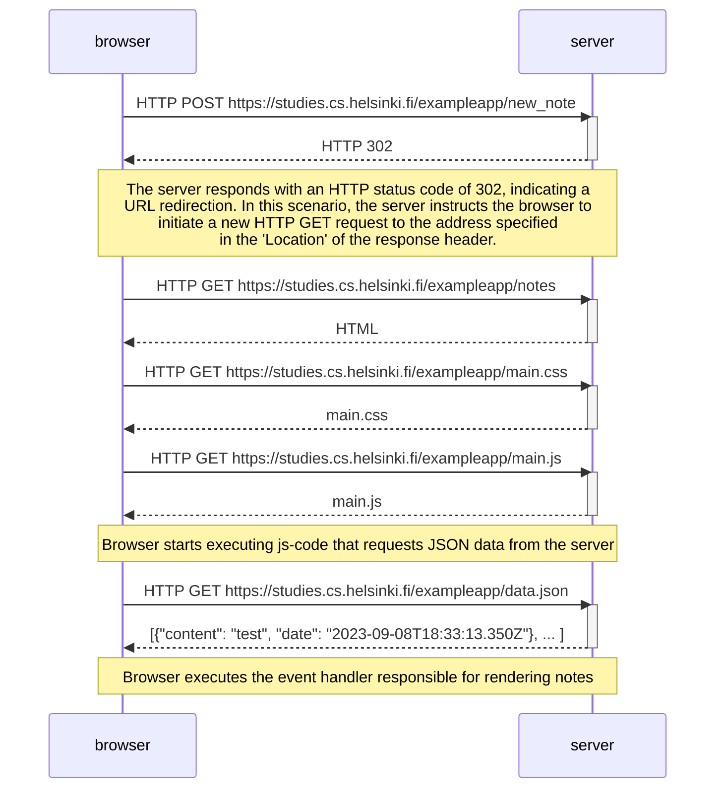

```mermaid

sequenceDiagram
    participant browser
    participant server

    browser->>server: HTTP POST https://studies.cs.helsinki.fi/exampleapp/new_note
    activate server
    server-->>browser: HTTP 302
    deactivate server

    Note over browser, server: The server responds with an HTTP status code of 302, indicating a <br/> URL redirection. In this scenario, the server instructs the browser to <br/> initiate a new HTTP GET request to the address specified <br/> in the 'Location' of the response header.

    browser->>server: HTTP GET https://studies.cs.helsinki.fi/exampleapp/notes
    activate server
    server-->>browser: HTML
    deactivate server

    browser->>server: HTTP GET https://studies.cs.helsinki.fi/exampleapp/main.css
    activate server
    server-->>browser: main.css
    deactivate server

    browser->>server: HTTP GET https://studies.cs.helsinki.fi/exampleapp/main.js
    activate server
    server-->>browser: main.js
    deactivate server

    Note over browser, server: Browser starts executing js-code that requests JSON data from the server


    browser->>server: HTTP GET https://studies.cs.helsinki.fi/exampleapp/data.json
    activate server
    server-->>browser: [{"content": "test", "date": "2023-09-08T18:33:13.350Z"}, ... ]
    deactivate server

    Note over browser, server: Browser executes the event handler responsible for rendering notes
```
