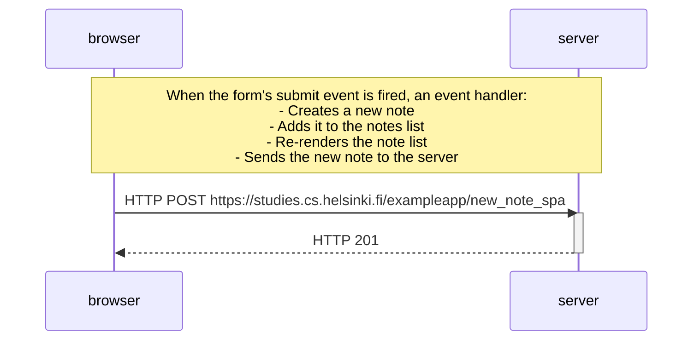

```mermaid

sequenceDiagram
    participant browser
    participant server

    Note over browser, server: When the form's submit event is fired, an event handler: <br> - Creates a new note <br> - Adds it to the notes list <br> - Re-renders the note list <br> - Sends the new note to the server

    browser->>server: HTTP POST https://studies.cs.helsinki.fi/exampleapp/new_note_spa
    activate server
    server-->>browser: HTTP 201
    deactivate server
```
